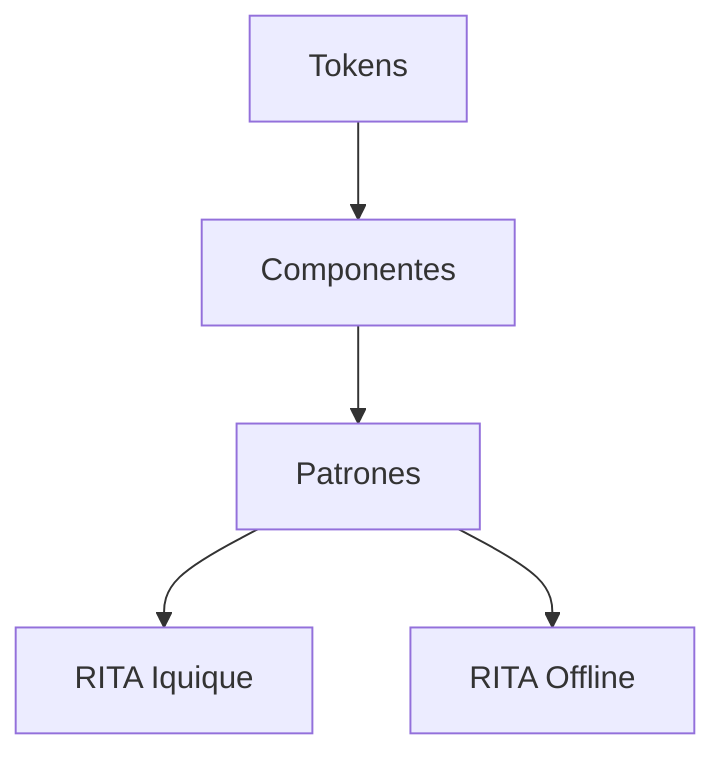

# Arquitectura

```mermaid
flowchart TD
  A["Tokens"] --> B["Componentes"]
  B --> C["Patrones"]
  C --> D["RITA Iquique"]
  C --> E["RITA Offline"]
```

Capas: raw tokens → semántica → contratos de dominio → componentes → patrones → adaptadores CSS/TS/Dart → productos. Esta librería no reemplaza bases, APIs ni catálogos.
