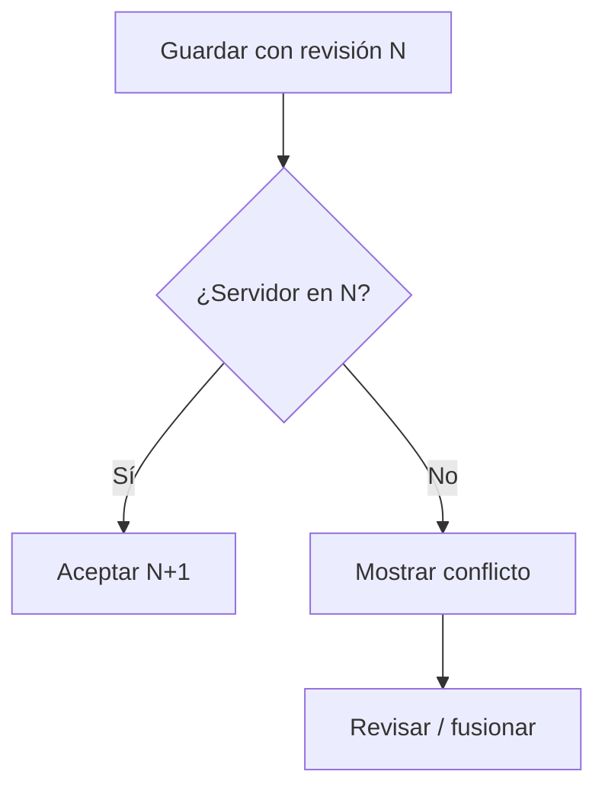

# Conflict resolution

Dos o tres técnicos pueden trabajar en la misma unidad.

Muestra cambios locales y remotos; ofrece conservar local, usar servidor o fusionar. Nunca resuelvas por último-guardado sin avisar. Fotos y líneas conservan identificadores.
