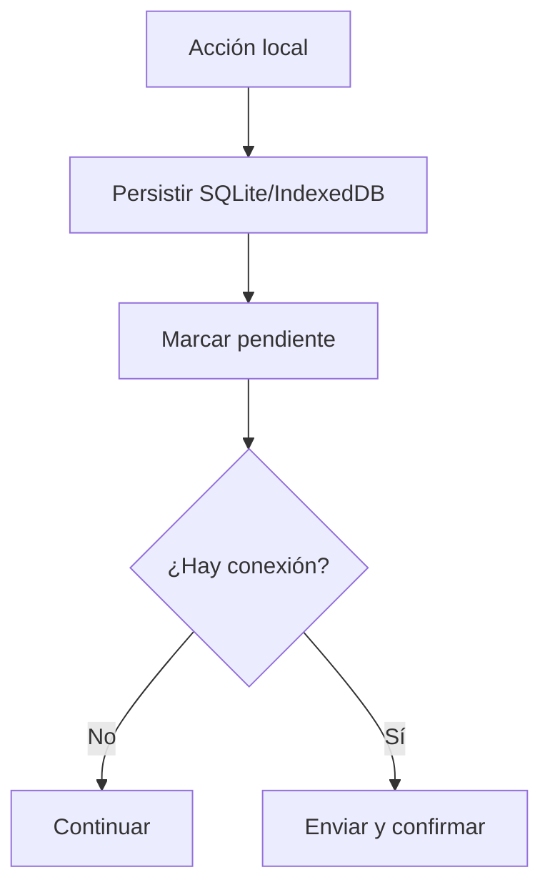

# Offline + sync

Offline-first es una propiedad de cada acción.

Persistir antes de red. Mostrar local/pendiente/confirmado/error. Reintentar al abrir y con **Sincronizar ahora**. No borrar antes de confirmación.
