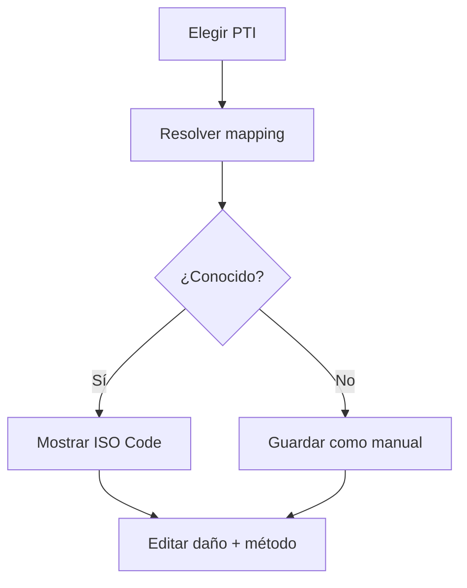

# PTI + CEDEX

Set operativo: RAPS, SHORT, LONG y CA. RUNNING y SUPER FREEZER no aparecen. La ubicación y método se consultan desde Grimorio; sin catálogo se permite entrada manual marcada para revisión.
