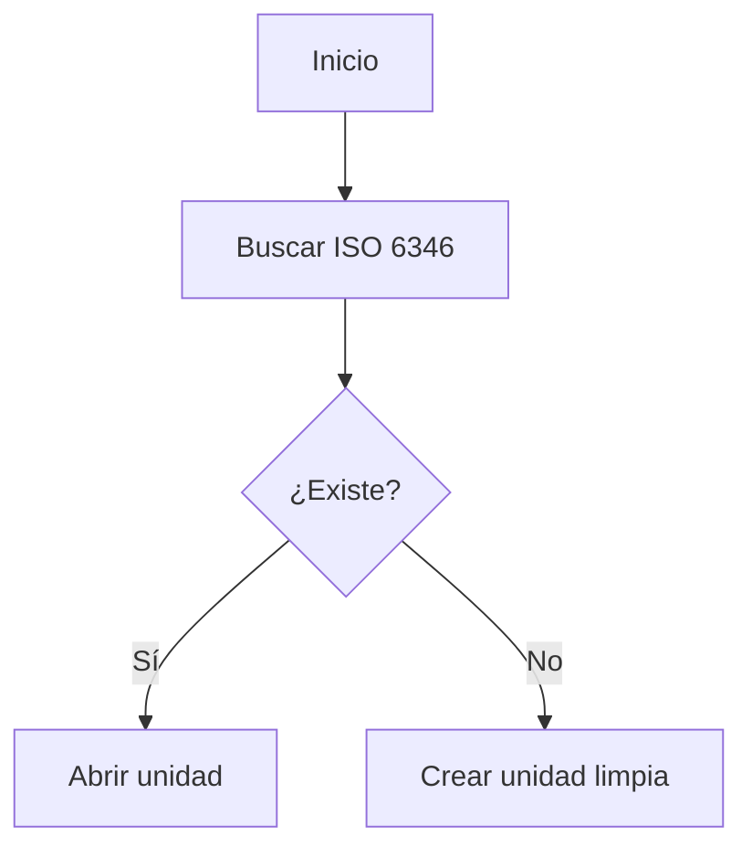

# Search first

El inicio pide una unidad; no descarga toda la base.

```mermaid
flowchart TD
  A["Inicio"] --> B["Buscar ISO 6346"]
  B --> C{"¿Existe?"}
  C -->|Sí| D["Abrir unidad"]
  C -->|No| E["Crear unidad limpia"]
```

Busca por número completo/fragmento, intenta cache local offline, indica la fuente y no mezcla datos de otra unidad.
